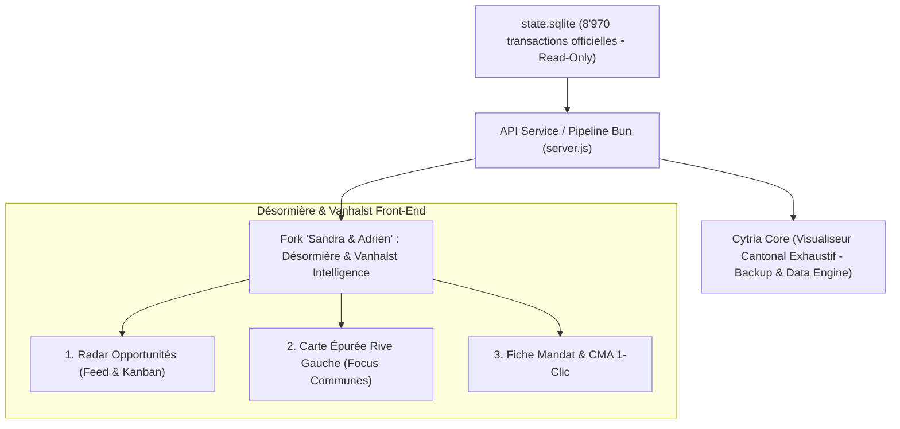

Searched for "Sandra"
Searched for "Adrien"
Searched for "desormiere"
Viewed agency_ranking.py:550-600

### 1. Rétrospective Critique : De l'Audit de Sécurité à l'Outil Métier de Prospection

L'audit chirurgical exécuté dans [App_analysis.md](file:///c:/Users/sbrot/DEV/Cytria_FAO_Scrapper_Intelligence_AGY/Prompts/App_analysis.md) a atteint son objectif défensif :

- **Sécurité & Légalité :** Fuites de fichiers statiques bloquées, injection SQL éliminée, SQLite en lecture seule stricte, et anonymisation nLPD des personnes physiques appliquée à la source sans backdoor client.
- **Rigueur Fiscale & Statistique :** Barèmes CASATAX 2026 calés sur **CHF 1'394'928**, allégations de « certification notariée » neutralisées en **CMA** (Analyses Comparatives de Marché), et vélocité des agences assainie.

**Le diagnostic critique d'usage :**
L'application actuelle dans [index.html](file:///c:/Users/sbrot/DEV/Cytria_FAO_Scrapper_Intelligence_AGY/index.html) a été conçue comme un **terminal SIG/Bloomberg pour analyste de données**. Pour des courtiers de terrain d'élite comme **Sandra Bleeckx Vanhalst** et **Adrien Désormière** (Désormière & Vanhalst, spécialistes Rive Gauche / Troinex / Veyrier / Cologny / Chêne-Bougeries) :

1. **Surcharge cognitive :** 8'500 pastilles sur une carte Leaflet et 40 filtres techniques génèrent de la friction plutôt que de la décision.
2. **Manque de hiérarchisation commerciale :** Un courtier ne veut pas chercher des aiguilles dans une botte de foin ; il veut se réveiller le lundi matin avec un **flux ordonné de signaux faibles à forte valeur ajoutée** :
   - *« Où est l'hoirie qui va devoir vendre pour partager les liquidités ? »*
   - *« Quelle parcelle de 1'500 m² en zone 5 possède des droits à bâtir résiduels pour une surélévation ou un détachement de parcelle ? »*
   - *« Quel voisin vient de vendre à un prix record au m², justifiant une tournée de porte-à-porte / courrier ciblé ? »*

---

## 2. Les « Low-Hanging Fruits » Immédiats (Gains Rapides)

La base contient déjà les données nécessaires ; il s'agit simplement de les **exposer sous forme de signaux qualifiés** :

| Opportunité Immédiate                                | Données Existantes dans le Repo                                                                                                       | Effort / Impact                              | Ce qu'on en tire                                                                                                                                                                                          |
| ---------------------------------------------------- | ------------------------------------------------------------------------------------------------------------------------------------- | -------------------------------------------- | --------------------------------------------------------------------------------------------------------------------------------------------------------------------------------------------------------- |
| **Filtre & Détecteur d'Hoiries (Successions)**       | Présent dans les textes bruts (`hoirie`, `hoirs de`, `communauté héréditaire`) et déjà indexé dans `developer_intelligence.is_hoirie` | **Faible (1 jour)** / **Impact Très Fort**   | Détection immédiate des biens en indivision successorale (art. 602 al. 2 CC). Dès 18 mois de détention sans vente, le risque de blocage ou d'action en partage (art. 604 CC) rend les héritiers vendeurs. |
| **Radar Droits à Bâtir Résiduels (Zone 5 & Villas)** | `scripts/build_developer_radar.ts` + couches SITG déjà enrichies (surface parcelle vs surface bâtie)                                  | **Faible (1 jour)** / **Impact Très Fort**   | Détection des parcelles surdimensionnées (> 1'000 m²) avec potentiel de division parcellaire ou de densification villa (IBS / IUS en zone 5).                                                             |
| **Générateur CMA 1-Clic pour Mandat**                | `valuation_service.ts` est déjà opérationnel et teste les percentiles (P25, Médiane, P75)                                             | **Très Faible (0.5 jour)** / **Impact Fort** | Un bouton « Générer l'Avis de Valeur » pour Sandra et Adrien : produit instantanément un PDF/HTML épuré aux couleurs de l'agence pour convaincre un propriétaire indécis.                                 |
| **Déclencheur « Vente Voisine Récente »**            | Table `transactions` avec géocodage LV95/WGS84                                                                                        | **Faible (1 jour)** / **Impact Fort**        | Dès qu'une vente est publiée à Troinex ou Veyrier, alerte immédiate sur les 10 parcelles adjacentes pour action de prospection directe.                                                                   |

---

## 3. Profil Métier de Sandra & Adrien (Désormière & Vanhalst)

D'après le profil dans [agency_ranking.py](file:///c:/Users/sbrot/DEV/Cytria_FAO_Scrapper_Intelligence_AGY/src/fao_transactions/visualization/agency_ranking.py#L560-L585) :

| Rôle                        | Cœur de Spécialité                                                                   | Communes Cibles                           | Ce qui déclenche un mandat chez eux                                                                                                                                        |
| --------------------------- | ------------------------------------------------------------------------------------ | ----------------------------------------- | -------------------------------------------------------------------------------------------------------------------------------------------------------------------------- |
| **Sandra Bleeckx Vanhalst** | Villas de caractère, successions familiales, hoiries Rive Gauche                     | Troinex, Veyrier, Chêne-Bougeries         | Les héritiers cherchant un accompagnement humain, discret et une valorisation argumentée pour éviter les conflits familiaux.                                               |
| **Adrien Désormière**       | Villas contemporaines/haut de gamme, terrains constructibles, investisseurs fonciers | Troinex, Plan-les-Ouates, Cologny, Genève | Les propriétaires de grands terrains en zone villa cherchant à maximiser leur plus-value foncière ou vendre à un promoteur avec clause suspensive de permis de construire. |

---

## 4. Stratégie de Fork & Architecture Produit

Pour préserver la base centrale tout en fournissant une application ultra-ciblée, nous pouvons adopter une architecture en **2 couches découplées** :

### A. Le Back-End : Moteur de Scoring Déterministe (`Opportunity Score` 0-100)

Sans altérer `state.sqlite`, on calcule dynamiquement un **Score de Mandat Prioritaire** combinant 4 signaux objectifs :

1. **Signal Hoirie / Succession (+35 pts) :** Acte de dévolution successorale ou présence d'hoirs multiples.
2. **Signal Droits Résiduels (+25 pts) :** Surface parcellaire $\ge 1'000\text{ m}^2$ en Zone 5 avec emprise au sol actuelle faible (potentiel de 2e villa ou agrandissement).
3. **Signal Ancienneté de Détention (+20 pts) :** Propriétaire ayant acquis le bien il y a plus de 15-25 ans (exonération maximale de l'impôt sur les gains immobiliers LIPP art. 82 + probabilité d'enfants ayant quitté le domicile / downsizing).
4. **Signal Dynamisme Micro-Quartier (+20 pts) :** Vente intervenue dans un rayon de 300 m au cours des 6 derniers mois avec prix au m² supérieur à la médiane communale.

### B. Le Front-End : Interface Simple, Familière et Sans Friction

Fini le tableau de bord abstrait à 10 onglets. L'expérience pour Sandra et Adrien doit ressembler à un **Notion / Airbnb / CRM haut de gamme** :

1. **Le « Feed du Matin » (Cards Prioritaires) :**
   - Chaque carte affiche : *Adresse*, *Commune*, *Score (ex: 88/100)*, *Badges clairs* : `[Hoirie Familiale]`, `[Terrain Détachable]`, `[Vente Voisine Récente]`.
   - Actions directes : *« Voir cadastre SITG »*, *« Télécharger dossier CMA »*, *« Marquer comme Prospecté »*.
2. **Le Sélecteur de Territoire Rapide :**
   - Boutons à 1 clic : `[Tout Rive Gauche]` `[Troinex]` `[Veyrier]` `[Chêne-Bougeries]` `[Vandoeuvres / Cologny]`.
3. **L'Estimaleur / CMA Express :**
   - Ils entrent une adresse ou cliquent sur une parcelle -> Affichage instantané :
     - Médiane du quartier au m².
     - Fourchette basse, recommandée et haute.
     - Éligibilité CASATAX (si < CHF 1'394'928).
     - Export PDF épuré à imprimer avant le rendez-vous vendeur.

---

## 5. Feuille de Route d'Implémentation Suggérée

Si vous souhaitez engager ce travail :

1. **Étape 1 : Le Moteur de Scoring Développeur & Hoiries (Backend)**
   - Écrire un module Bun/TypeScript léger `src/fao_transactions/opportunity_engine.ts` qui interroge `state.sqlite` en lecture seule et attribue un score d'opportunité par parcelle/acte.
2. **Étape 2 : L'Endpoint REST Dédié**
   - Ajouter la route `/api/agency/opportunities?agency=desormiere-vanhalst&communes=troinex,veyrier,chene-bougeries` renvoyant le flux classé par pertinence commerciale.
3. **Étape 3 : L'Interface Dédiée (Ex: `dv_radar.html` ou `/dv`)**
   - Concevoir une vue épurée, responsive (mobile/tablette pour visites), avec une palette raffinée adaptée à Désormière & Vanhalst, focalisée sur la conversion commerciale immédiate.

Souhaitez-vous que l'on commence par prototyper le moteur de scoring d'opportunités (Backend) ou par maquetter l'interface du « Feed Opportunités » de Sandra & Adrien ?
