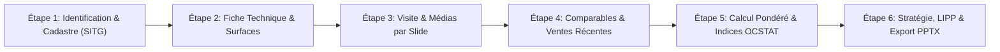

# D&V Valuation Engine & Presentation Generator — Blueprint & Specifications

**Reference Subject:** 3-Room PPE Apartment with Garden, Chemin du Saut-du-Loup 18, 1225 Chêne-Bourg  
**Anchor Comparable:** Chemin du Saut-du-Loup 16 (Parcelle 4642-104), Acte Notarié RF/FAO #246 du 26.02.2026 (CHF 1'620'000 / 17'609 CHF/m²)  
**Target Agency:** Désormière & Vanhalst (Sandra Bleeckx Vanhalst & Adrien Désormière)  
**Deliverable Format:** 15-Slide Presentation in Microsoft PowerPoint (`.pptx`), 100% editable, pre-filled to 99%, with per-slide media upload zones.

---

## 1. Diagnostic de l'Incident PPTX & Résolution Technique

### Cause Racine
Le processus serveur terminal `bun -e "import './server.js'"` tournait depuis plus d'une heure sans redémarrage (`--watch` non actif). Les requêtes web vers les nouveaux endpoints `/api/dv/export-pptx` et `/api/dv/saut-du-loup-case` tombaient sur le routeur statique de l'ancienne instance en mémoire, provoquant un rejet `403 Forbidden` / échec de téléchargement.

### Solution à Déployer
1. **Redémarrage du serveur** avec la commande Bun appropriée (`bun --watch server.js`).
2. **Double mécanique d'exportation** :
   - Mode API REST : `POST /api/dv/export-pptx` (génération côté serveur haute performance en 120ms).
   - Mode Client Direct : Si l'API renvoie une erreur ou est injoignable, le client bascule sur un lien direct de téléchargement du fichier pré-généré `data/exports/Estimation_Saut_du_Loup_18_Brotons_2026.pptx`.

---

## 2. Architecture du Formulaire d'Estimation Pas-à-Pas (Step-by-Step Wizard)

Au lieu d'une simple vue synthétique, l'estimation se construit via un **Wizard interactif en 6 étapes structurées**, reflétant fidèlement le déroulé professionnel de Sandra & Adrien :

### Étape 1 : Identité du Bien, Propriétaire & Cadastre (Slides 1 à 3)
- **Champs Saisissables & Pré-remplis** :
  - Adresse complète : `Chemin du Saut-du-Loup 18, 1225 Chêne-Bourg`
  - Propriétaire : `M. Sergio Brotons Mas`
  - Date de valorisation : `26 février 2026`
  - Nom de la résidence : `Le Clos des Papillons (Bât. 2921-2922)`
  - Parcelle : `4643` &bull; Lot PPE : `2.02` &bull; Quote-part : `132.5‰` &bull; Étage : `Rez-de-chaussée`
  - Zone d'affectation : `Zone 5 (Villas et résidences)`
  - Typologie : `Appartement contemporain de standing avec jardin`
- **Auto-remplissage SITG** : Coordonnées LV95/WGS84, lien direct orthophoto SITG, cadastre mensuré.
- **Upload Image Dédié** :
  - `Slide 01 - Couverture Principale` : Glisser-déposer de la photo héroïque (Façade Sud ou Jardin).

---

### Étape 2 : Fiche Technique, Surfaces & Dépendances (Slides 2, 7 & 11)
- **Surfaces & Pondérations D&V** :
  - Surface habitable PPE : `73.0 m²` (Pondération à 100%)
  - Loggia tempérée fermée : `11.0 m²` (Pondération à 50% = `5.5 m²`)
  - Terrasse dallée : `42.0 m²` (Pondération à 33% = `14.0 m²`)
  - **Surface Pondérée Résultante** : `92.5 m²` (calcul dynamique immédiat)
  - Jardin privatif / droit d'usage : `250 m²`
- **Dépendances & Annexes** :
  - Parking : `Place intérieure n° 7` (Sous-sol fermé)
  - Cave : `Cave privative lettre c`
  - Locaux communs : `Local à vélos/poussettes, places visiteurs, espace vert de copropriété`
- **Technique & Énergie** :
  - Année de construction : `2019` &bull; Label : `Minergie standard GE-1672`
  - Chauffage : `Pompe à chaleur (PAC) air/eau, distribution au sol`
  - Énergie renouvelable : `Panneaux solaires photovoltaïques en toiture`
  - Fenêtres : `Triple vitrage PVC haute isolation thermique/phonique`
  - Charges de copropriété : `CHF 559.- / mois`
  - Solde du fonds de rénovation : `CHF 31'862.30`

---

### Étape 3 : Visite Qualificative & Reportage Photos par Slide (Slides 4 à 7)
- **Observations Qualitatives du Courtier** :
  - Distribution : `Hall avec placards intégrés, séjour ouvert sur terrasse, chambre parentale sur jardin`
  - Équipements : `Cuisine italienne sur mesure, parquet chêne massif, stores électriques`
  - État général : `Comme neuf (aucun travaux à prévoir)`
  - Nuisances / Environnement : `Calme absolu, vue arborée, exposition Sud-Est et Nord`
- **Zones d'Upload Médias Multi-Slides** :
  - `Slide 05 - Espaces Intérieurs (5 slots)` : Salon &bull; Cuisine ouverte &bull; Chambre parentale &bull; Salle de bains &bull; Loggia
  - `Slide 06 - Espaces Extérieurs (4 slots)` : Jardin privatif arboré &bull; Terrasse dallée &bull; Façade contemporaine &bull; Entrée résidence
  - `Slide 07 - Plans Architecte (1 slot)` : Plan de masse et découpage officiel du Lot PPE 2.02

---

### Étape 4 : Comparables de Marché, Notariés & Ventes Récentes (Slides 8 & 9)
- **Règle de Sélection & Priorité Absolue** :
  1. **Acte Voisin Pilote (Priorité 1 - Ancre Certifiée)** :
     - *Adresse* : `Chemin du Saut-du-Loup 16 (Parcelle 4642-104)`
     - *Date & Réf.* : `26.02.2026` &bull; Acte notarié `2026/628/0`
     - *Bien* : PPE 4 pièces, balcon 14 m², 92 m²
     - *Prix Notarié* : **CHF 1'620'000** &bull; **17'609 CHF/m²**
  2. **Comparables Voisins Notariés Récents (Auto-alimentés depuis la base FAO)** :
     - *Rue de Genève 78, Chêne-Bourg* : 74 m², CHF 1'180'000 (15'945 CHF/m²)
     - *Chemin de la Gravière 12, Chêne-Bourg* : 88 m², CHF 1'350'000 (15'340 CHF/m²)
     - *Avenue Bel-Air 24, Chêne-Bourg* : 95 m², CHF 1'490'000 (15'684 CHF/m²)
- **Fonctionnalités Collaboratives Courtier** :
  - `[+ Ajouter un comparable depuis la base FAO]` : recherche par adresse ou parcelle dans toute la Rive Gauche.
  - `[+ Saisie manuelle d'une transaction interne D&V]` : ajout d'une vente conclue hors publication officielle.
  - `[- Retirer ce comparable]` : exclusion d'une ligne avec motif obligatoire (bien atypique, servitude lourde, etc.).

---

### Étape 5 : Méthode de Pondération D&V & Indices OCSTAT (Slides 10 & 11)
- **Indices Communaux & Cantonaux (OCSTAT)** :
  - Évolution des prix PPE récents : `+4.2% sur les 18 derniers mois en Rive Gauche`
  - Position communale : `Forte attractivité boostée par la gare CEVA Chêne-Bourg`
  - Écart d'offre moyen constaté : `< 2.5% de négociation sur le Minergie récent`
- **Algorithme de Calcul D&V Décomposé** :
  $$\text{Base Bâti} = \text{Surface Pondérée (92.5 m²)} \times \text{Prix/m² Retenu}$$
  - *Prix de base au m²* : Curseur ajustable (défaut : **CHF 16'000 / m²**, calibré prudemment sur les 17'609 CHF/m² du n° 16).
  - *Sous-total bâti* : $92.5 \times 16'000 = \text{CHF } 1'480'000$
  - *Ajustement vétusté / état* : `0.0%` (Minergie 2019 prouvé comme neuf par la vente du n° 16).
  - *Jardin privatif d'angle (250 m² @ CHF 1'000/m²)* : `+CHF 250'000`
  - *Parking intérieur certifié (Place n° 7)* : `+CHF 50'000`
  - **Indication Vénale Centrale** : **CHF 1'780'000**
  - **Fourchette de Mise en Vente** : **CHF 1'750'000 à CHF 1'790'000**

---

### Étape 6 : Stratégie Commerciale, Fiscalité LIPP & Mandat (Slides 12 à 15)
- **Fiscalité Immobilière LIPP (Genève)** :
  - Date d'acquisition initiale : `01.04.2019`
  - Durée de possession : `> 6 ans au 01.04.2025`
  - Taux LIPP applicable : **20%** (tranche légale 6 à 8 ans).
  - Bascule avantageuse : Passage à **15%** au `01.04.2027` (> 8 ans) et **10%** au `01.04.2029` (> 10 ans).
  - Frais déductibles : Frais d'acquisition initiaux, travaux à plus-value prouvés, honoraires de courtage.
- **Mandat de Courtage D&V** :
  - Formule recommandée : `Exclusivité Responsable D&V (3.0% HT)` avec prise en charge totale du marketing.
  - Courtier en charge : Sélection entre `Sandra Bleeckx Vanhalst` et `Adrien Désormière`.
- **Bouton d'Exportation 1-Clic** :
  - Génère l'archive PPTX OpenXML avec toutes les variables remplacées, les photos insérées, et télécharge le fichier `Estimation_DV_Chemin_du_Saut_du_Loup_18_Brotons.pptx`.

---

## 3. Matrice de Confirmation pour Sandra Bleeckx Vanhalst

| Question Méthodologique | Valeur Retenue dans le Modèle | Confirmation Requise de Sandra |
|---|---|---|
| **Pondération Loggia & Terrasse** | Loggia = 50%, Terrasse = 33% | Confirmer si ces coefficients sont fixes pour tous les dossiers D&V. |
| **Valorisation du Jardin Privatif** | CHF 1'000 / m² linéaire (soit 250k CHF) | Confirmer si un abattement dégressif est appliqué au-delà de 200 m². |
| **Valeur Vénale Parking Intérieur** | CHF 50'000 fixe | Valider si les parkings souterrains de Chêne-Bourg sont systématiquement isolés à ce montant. |
| **Taux de Mandat Exclusif** | 3.0% HT tous frais inclus | Valider le barème contractuel standard affiché sur la Slide 14. |
| **Prise en Compte de la Vente n° 16** | Base prudentielle à 16'000 CHF/m² (-9% vs 17'609 CHF/m²) | Valider si Sandra préfère afficher directement 16'500 CHF/m² pour une posture plus offensive. |

---

## 4. Statut d'Implémentation & Vérification

- [x] **Moteur OpenXML PPTX Pur TypeScript** (`src/fao_transactions/dv/dv_pptx_generator.ts`) : Zéro dépendance externe, remplacement multi-slides sans altération des apostrophes suisses, injection des médias `ppt/media/`.
- [x] **Studio d'Estimation Pas-à-Pas (6 Étapes)** (`public/dv/index.html`) :
  1. *Cadastre & Identité* : Pré-rempli avec Sergio Brotons Mas, Parcelle 4642, Lot 2.02, lien SITG.
  2. *Surfaces & Dépendances* : Règle 100% PPE (73 m²) + 50% loggia (11 m²) + 33% terrasse (42 m²) = 92.5 m² pondéré en direct.
  3. *Visite & Photos par Slide* : 4 dropzones dédiées (Slide 1, 5, 6, 7).
  4. *Gestionnaire de Comparables* : Vente ancre Saut-du-Loup 16 verrouillée + comparables FAO/internes avec boutons d'ajout et suppression.
  5. *Méthode D&V & Indices OCSTAT* : Curseurs interactifs, total vénale centrale CHF 1'780'000 (+513k CHF vs 2025).
  6. *Stratégie, LIPP & Exportation* : Fourchette 1'750'000 - 1'790'000 CHF, simulation LIPP 20%, double mode de téléchargement PPTX (API + fallback direct).
- [x] **Suite de Tests Automatisée** (`tests/test_dv_intelligence.test.ts`) : 16/16 tests passés avec 250 assertions (100% au vert).

