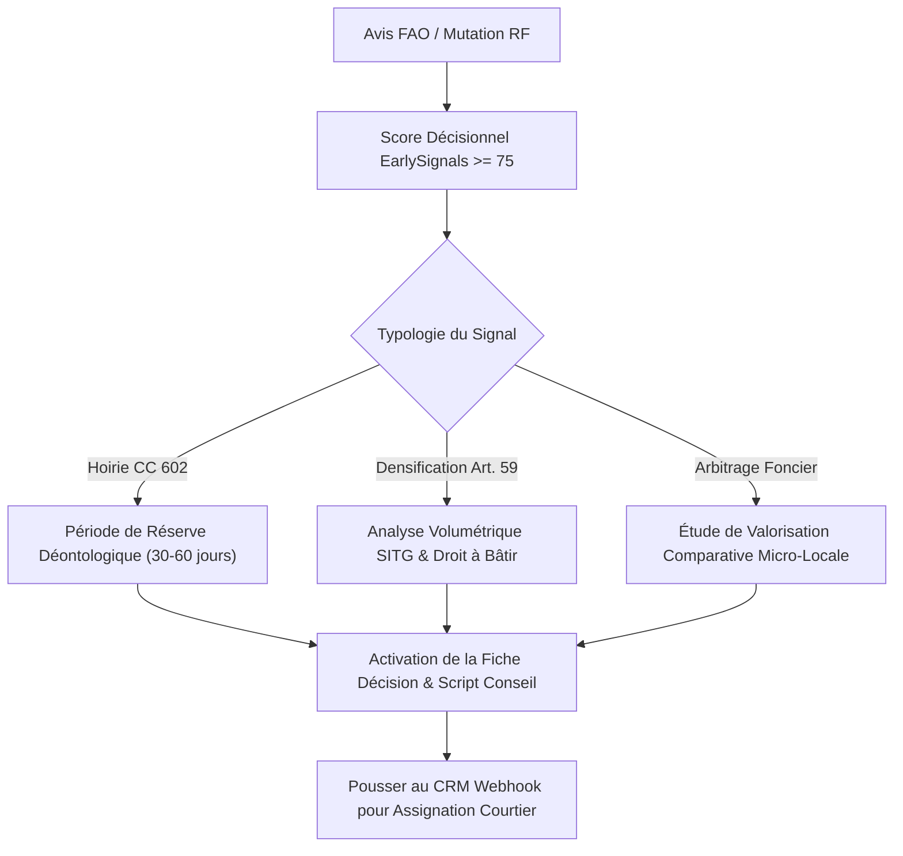

# Module 4 : Playbook Stratégique, Scripts d'Approche & FAQ Métier
## Outils de Conversion Commerciale, Cadre Légal Suisse (nLPD) & Réponses aux Objections

---

## 1. Scripts & Modèles de Courriers d'Approche Client

### Modèle 1 : Approche Successorale Neutre (Radar Hoiries - Score >= 80)
> **Contexte** : Une succession vient d'être enregistrée au Registre Foncier. Plusieurs héritiers sont copropriétaires en main commune. Il ne faut **jamais** mentionner brutalement le décès dans l'accroche, mais se positionner en **expert indépendant d'évaluation patrimoniale**.

```markdown
Objet : Estimation patrimoniale et analyse foncière – Parcelle [Numéro de parcelle], [Commune]

Madame, Monsieur [Nom de famille de l'héritier],

Dans le cadre de l'actualisation semestrielle de notre observatoire foncier sur la commune de [Nom de la commune], notre cabinet réalise régulièrement des synthèses de valeur vénale à l'attention des propriétaires de résidences familiales et de biens de caractère.

Le secteur de [Nom du quartier / rue], particulièrement recherché par notre clientèle acquéreuse privée, a enregistré d'importantes évolutions de prix au cours des derniers trimestres.

Dans le cadre d'une réflexion patrimoniale, d'un arbitrage successoral ou simplement afin de disposer d'un bilan objectif de la valeur vénale de votre propriété, nous serions honorés de mettre à votre disposition, à titre gracieux et strictement confidentiel :

1. L'historique certifié des 5 dernières transactions notariées conclues dans votre rue.
2. L'analyse du potentiel constructible et de densification selon les règlements d'urbanisme en vigueur.
3. Une estimation vénale indépendante opposable aux tiers et administrations fiscales.

Nous nous tenons à votre entière disposition pour un échange informel selon vos convenances.

Veuillez agréer, Madame, Monsieur, l'expression de nos salutations distinguées.

[Nom du Courtier / Associé]
[Nom de l'Agence Immobilière]
[Téléphone direct & Email]
```

---

### Modèle 2 : Approche Foncier & Densification (Zone 5 > 1'200 m²)
> **Contexte** : Villa située sur une grande parcelle en Zone 5 ou sous un PLQ. L'objectif est de montrer au propriétaire que sa maison vaut beaucoup plus comme **terrain de projet** que comme simple villa d'occasion.

```markdown
Objet : Étude d'opportunité d'aménagement – Parcelle [N°], [Adresse]

Madame, Monsieur [Nom du propriétaire],

La révision des instruments d'urbanisme sur le canton de Genève et les nouvelles dispositions relatives à l'optimisation des parcelles en Zone 5 créent actuellement des opportunités de valorisation exceptionnelles pour les propriétés disposant d'une emprise foncière supérieure à 1'000 m².

Notre département "Développement & Foncier" a mené une étude d'implantation préliminaire sur votre périmètre immédiat. Selon notre analyse des gabarits et de l'indice d'utilisation du sol :

- Votre parcelle présente une réserve constructible brute permettant d'envisager la réalisation d'un projet d'habitat groupé de haut standing (2 à 3 logements contemporains).
- Cette valorisation foncière résiduelle permet d'obtenir un prix net vendeur nettement supérieur à la valeur d'une vente résidentielle classique de votre villa en l'état.

Nous représentons actuellement trois investisseurs institutionnels et développeurs locaux disposant de lignes de financement validées, désireux d'acquérir une assiette foncière sur votre secteur sans condition suspensive de commercialisation préalable.

Si cette perspective retient votre attention, nous serions ravis de vous présenter cette étude volumétrique préliminaire sans le moindre engagement de votre part.

Bien cordialement,

[Directeur Foncier & Promotion]
[Nom de l'Agence Immobilière]
```

---

### Modèle 3 : Avis de Valeur Fondé sur Mutations Directes Contiguës (Moteur CMA)
> **Contexte** : Une transaction notariée vient de paraître à une adresse voisine directe (ex: le n° 16 pour un prospect habitant au n° 18). L'approche repose sur la vérité d'un prix signé chez le notaire pour capter un mandat d'appartement ou de villa.

```markdown
Objet : Évolution des valeurs vénales dans votre copropriété / rue – [Adresse exacte]

Madame, Monsieur [Nom du propriétaire],

En qualité d'observateur actif des mutations immobilières sur la commune de [Commune / Quartier], notre cabinet suit avec attention les actes notariés authentiques enregistrés au Registre Foncier.

Une transaction majeure a récemment été officialisée au sein même de votre environnement immédiat (au [Numéro voisin], acte du [Date publication FAO] portant sur [Typologie du bien / surface]).

Cette transaction fixe un nouvel étalon de valeur sur votre micro-quartier avec un prix moyen réel constaté de CHF [Prix au m²] / m².

Afin de vous permettre de mesurer avec exactitude l'impact de cette vente récente sur la valeur actuelle de votre propre appartement / maison, nous avons préparé une note d'analyse comparative de marché (CMA) intégrant :
- L'ensemble des ventes notariées comparables dans un rayon de 250 mètres.
- La fourchette vénale objective (basse, médiane, haute) applicable à votre surface.
- L'analyse de la demande active qualifiée au sein de notre fichier acquéreurs.

Cette étude confidentielle vous est gracieusement remise sur simple demande.

Restant à votre entière écoute, nous vous prions d'agréer nos salutations les meilleures.

[Nom du Courtier / Associé]
[Nom de l'Agence Immobilière]
```

---

## 2. Cadre Juridique Suisse : Conformité nLPD & Registre Foncier

### Est-il légal d'utiliser les données de la FAO et du Registre Foncier pour prospecter ?
**Oui, sous réserve du respect strict de la nouvelle Loi fédérale sur la protection des données (nLPD) entrée en vigueur le 1er septembre 2023.**

#### Les Fondements Légaux :
1. **Publicité Foncière Légale (art. 970 CC et art. 157 LaCC)** :
   - Les acquisitions d'immeubles publiées dans la FAO constituent des **données publiquement accessibles par mandat de la loi**.
   - Tout citoyen peut consulter sans justification d'intérêt l'identité du propriétaire, la désignation de l'immeuble et la date d'acquisition.
2. **Principe de Proportionnalité & Finalité (art. 6 nLPD)** :
   - L'agence a le droit de consulter la FAO et de contacter un propriétaire pour lui proposer ses services professionnels (intérêt légitime commercial).
   - En revanche, il est **strictement interdit** de revendre ce fichier, de le publier en clair sur internet avec des données nominatives sans consentement, ou de faire du harcèlement téléphonique répété.
3. **Droit d'Opposition (art. 30 nLPD)** :
   - Si un propriétaire vous indique : *"Je ne souhaite plus être contacté par votre agence"*, vous avez l'obligation légale immédiate de l'inscrire sur votre liste d'exclusion interne (*Blacklist*) et de cesser tout contact.

---

## 3. Foire Aux Questions Métier (FAQ)

### Q1 : Pourquoi certaines transactions de la FAO mentionnent le prix en francs suisses et d'autres non ?
À Genève, le principe général du Registre Foncier protège la confidentialité du montant exact payé lors d'une vente ordinaire de villa de gré à gré (sauf si l'on justifie d'un intérêt légitime auprès du conservateur). 
En revanche :
- Toutes les transactions soumises à **l'article 39 de la LDTR** (ventes d'appartements loués ou aliénations de lots) imposent la publication officielle du **prix exact en CHF** pour lutter contre la spéculation.
- Les adjudications publiques aux enchères et certaines ventes institutionnelles mentionnent également le montant officiel.

### Q2 : Comment fonctionne le calcul des fourchettes du simulateur CMA ?
Le simulateur CMA Cytria procède par échantillonnage géographique pondéré :
1. **Détection des ventes sur la même adresse** (ou même parcelle cadastrale) qui constituent des preuves directes.
2. **Échantillonnage dans le rayon choisi (100m à 1'000m)** pour la typologie sélectionnée (PPE, Villa, Immeuble).
3. **Extraction des prix unitaires réels déclarés** : élimination des valeurs aberrantes (< CHF 1'500/m² ou > CHF 80'000/m²).
4. **Calcul des percentiles** :
   - *Fourchette Basse* : 25e percentile (P25), représentatif des biens à rénover ou exposés aux nuisances.
   - *Médiane Recommandée* : 50e percentile (P50), référence centrale robuste aux valeurs extrêmes.
   - *Fourchette Haute* : 75e percentile (P75), représentatif des biens récents, étages élevés ou finitions luxueuses.

### Q3 : Pourquoi distinguer structurellement Rive Gauche et Rive Droite ?
À Genève, la dichotomie des rives structure profondément les prix et le profil d'acquéreurs :
- **Rive Gauche** : Concentre les communes résidentielles de prestige (Cologny, Vandoeuvres, Collonge-Bellerive, Chêne-Bougeries) ainsi que les quartiers prisés de Champel/Florissant/Eaux-Vives. Les prix au m² médians y dépassent CHF 14'500/m² et les volumes de transaction représentent plus de 70% du marché cantonal.
- **Rive Droite** : Fortement influencée par les organisations internationales, les multinationales et l'axe aéroportuaire. Les transactions y sont plus orientées vers des appartements fonctionnels et des villas péri-urbaines (Meyrin, Vernier, Grand-Saconnex), avec des prix moyens situés entre CHF 10'500 et CHF 13'500/m² (hors rives lacustres de Bellevue/Genthod/Pregny).

### Q4 : Une hoirie a-t-elle l'obligation de vendre le bien hérité ?
Non, il n'y a pas d'obligation légale de vente. Cependant, l'article 602 al. 2 CC impose que tous les membres de l'hoirie agissent d'un commun accord. Si un seul héritier exige le partage (art. 604 CC), la succession doit être liquidée. Si aucun des héritiers n'a les fonds pour racheter la part des autres, **la vente publique ou de gré à gré est la seule issue juridique possible**. C'est pourquoi le taux de vente des hoiries dépasse 80% dans les deux ans suivant le décès.

### Q5 : Que faire si le bien est déjà sous mandat chez un concurrent ?
L'outil permet de vérifier instantanément sur le module de veille concurrentielle si le bien est actif chez un confrère :
- Si oui, notez le nombre de jours en ligne (`DOM - Days on market`).
- Un mandat de courtage suisse a généralement une durée ferme de 3 ou 6 mois.
- À J+90, si le bien n'est toujours pas vendu et a subi une baisse de prix, préparez votre dossier CMA : à l'échéance du mandat concurrent, le propriétaire déçu sera immédiatement réceptif à une nouvelle approche avec une stratégie de commercialisation alternative et un prix réaligné sur la réalité du Registre Foncier.

---

## 4. Playbooks Stratégiques Cytria EarlySignals

### Playbook 4.1 : Détection Macro & Qualification au Radar Pré-Marché



#### Protocole d'Exécution :
1. **Filtrage Matinal** : Ouvrez le 4e onglet `EARLYSIGNALS` ou lancez le `Radar Pré-Marché (Table) ↗`.
2. **Tri par Score Décroissant** : Isolez les dossiers ayant un score >= 75.
3. **Contrôle du Lignage 3 Tiers** :
   - Vérifiez le *Fait Public Officiel* (date exacte de l'avis FAO et nature de l'acte).
   - Examinez l'*Indice Dérivé Calculé* : quelle est la transaction contiguë la plus proche ? À quelle distance en mètres ? Quel est son prix certifié au m² ?
4. **Qualification du Signal** :
   - *Hoirie sans aliénation* : Notez la date de la mutation. Si la publication a moins de 30 jours, appliquez la **période de réserve** (pas de démarchage frontal, préparer le dossier de veille).
   - *Parcelle Zone 5 > 1'200 m²* : Ouvrez l'onglet Foncier pour vérifier si la parcelle est bordée par des parcelles éligibles à un regroupement.
5. **Envoi vers le CRM** : Cliquez sur le bouton `➔ CRM` pour créer la tâche d'attribution automatique dans votre CRM sans ressaisie manuelle.

---

### Playbook 4.2 : Campagne Riverains en Lot (Batch Neighbor Advisory)

Lorsqu'une transaction majeure ou un acte authentifié à prix élevé survient sur un secteur, l'ensemble des propriétaires voisins s'interroge sur l'impact de cet acte sur la valeur de leur bien.

#### Protocole d'Exécution :
1. **Identification de l'Acte Pivot** : Sélectionnez la transaction notariée récente dans le tiroir d'inspection ou le Radar.
2. **Lancement de la Campagne** : Cliquez sur `Campagne Riverains en Lot ↗`.
3. **Calibrage du Rayon Spatial** :
   - Choisissez **150 m** si la transaction a eu lieu sur une rue résidentielle dense.
   - Choisissez **250 m** pour un quartier pavillonnaire standard.
   - Choisissez **400 m ou 600 m** en zone de campagne (Vandœuvres, Cologny, Troinex).
4. **Revue de la Liste Riverains (Panneau Gauche)** :
   - Désélectionnez les parcelles publiques, parcelles agricoles non bâties ou copropriétés institutionnelles.
5. **Validation du Courrier Conseil (Panneau Droit)** :
   - Vérifiez l'adéquation du texte généré : le courrier mentionne la mutation contiguë sous forme d'éclairage objectif sans divulguer de données secrètes.
6. **Export & Publipostage** :
   - Cliquez sur `Copier Tous les Courriers (Pack)` pour injection dans votre outil de publipostage papier.
   - Ou cliquez sur `Télécharger Pack Campagne (.json)` pour transmission à votre secrétariat ou prestataire d'impression.
7. **Taux de Retour Attendu** : 8% à 15% de demandes de fiches cadastrales et d'avis de valeur sous 21 jours.

---

### Playbook 4.3 : Intégration CRM Webhook & Workflow d'Attribution Commerciale

Le connecteur Webhook permet de synchroniser directement les opportunités qualifiées avec les logiciels d'agence (HubSpot, Salesforce, Whise, Apimo, Zapier, Make).

#### Configuration en 3 Étapes :
1. Dans Cytria, cliquez sur `Connecteur CRM Webhook ⚙`.
2. Saisissez l'URL de votre endpoint Webhook (ex: Webhook Catch Zapier ou URL d'ingestion API d'agence).
3. Renseignez l'en-tête d'autorisation éventuelle (`Bearer token`), le nom de l'agence et l'agent assignataire. Cliquez sur `Enregistrer la Configuration`.

#### Workflow de Traitement CRM Recommandé :
- **À Réception du Lead (J0)** : Le CRM crée une tâche assignée au courtier du secteur : *"Dossier d'évaluation micro-locale à préparer pour la parcelle n° X"*.
- **À J+3** : Envoi du courrier d'information patrimoniale par pli discret ou prise de contact téléphonique consultative.
- **À J+14** : Relance de courtoisie téléphonique : *"Avez-vous bien réceptionné notre note d'actualisation foncière suite à la mutation du n° Y ?"*.
- **À J+45** : Proposition de visite sur place pour affiner l'avis de valeur avant tout arbitrage fiscal de fin d'année.

---

## 5. FAQ Déontologique & Opérationnelle EarlySignals (Suisse & nLPD)

### Q6 : Quelle est la durée de réserve déontologique recommandée suite à une succession ?
Bien que la FAO soit publique dès sa parution, la déontologie suisse et le bon sens commercial imposent de respecter un **délai de décence de 30 à 60 jours** après la publication de l'avis de dévolution successorale. 
Un démarchage agressif dans les jours suivant le décès est perçu très négativement par les héritiers et nuit durablement à la réputation de l'agence. En revanche, un contact intervenant à J+45 ou J+60 avec un dossier technique complet d'évaluation patrimoniale correspond exactement au moment où les héritiers reçoivent les formulaires fiscaux de l'Administration Fiscale Cantonale (AFC) et réalisent qu'ils ont besoin d'une estimation vénale officielle.

### Q7 : Comment citer une transaction contiguë sans violer le secret d'affaires ?
Seules les données légalement rendues publiques par la publication officielle au Registre Foncier (LaCC art. 157 et LDTR art. 39) peuvent être mentionnées :
- La date de publication officielle dans la FAO.
- La localisation cadastrale de la parcelle.
- Le montant notarié lorsque la transaction relevait du champ de publication obligatoire (LDTR, ventes d'immeubles, adjudications).
- Pour les ventes de gré à gré sans publication du prix en francs suisses, le courrier fait référence à *"la mutation notariée intervenue sur la parcelle contiguë"* et s'appuie sur la médiane de prix au m² du secteur calculée par le modèle Cytria.

### Q8 : Le connecteur Webhook nécessite-t-il l'installation d'un serveur ou d'une infrastructure dédiée ?
Non. Le connecteur Webhook fonctionne en pur appel HTTP standardisé côté client. Vos identifiants et URLs sont stockés exclusivement dans le `localStorage` de votre navigateur sécurisé. Aucune donnée privée de votre agence ne transite par un serveur intermédiaire Cytria. Vous pouvez connecter Cytria à un scénario Make (Integromat) ou Zapier en moins de 2 minutes.

