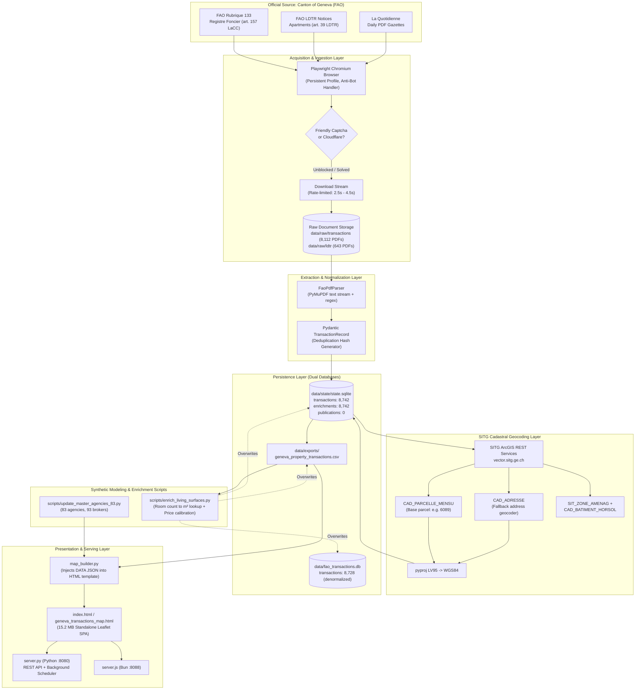

# Stage 1 — System Discovery & Architecture Audit

**Target System**: Cytria — Geneva Real Estate & Land Intelligence Platform (`FAO-Scrapper-Visualizer`)  
**Date**: 2026-09-28  
**Audit Stage**: Stage 1 (Discovery & Architecture)  
**Standard**: Strict Evidence-Based Audit (`00_README_FIRST.md`, `01_MASTER_INSTRUCTIONS.md`, `02_SYSTEM_DISCOVERY.md`)  
**Status**: VERIFIED & DOCUMENTED  

---

## 1. Executive Summary

This audit establishes the baseline system architecture of the Geneva Property Transactions Intelligence platform (branded **Cytria**). The platform's objective is to extract official property sale notices from the Geneva Official Gazette (*Feuille d'avis officielle* — FAO), link them with official Geneva cadastral and planning data from the *Système d'Information du Territoire à Genève* (SITG), enrich them with living surface models and market indicators, and present the intelligence in an interactive GIS single-page application.

Based on static analysis of source code, inspection of production SQLite databases, and examination of raw document storage, this audit reveals a functioning but structurally fragile end-to-end data pipeline with several **critical trust breaks**:
1. **Dual database divergence**: Two distinct SQLite databases exist with different row counts and schemas, while key visualizer components prefer a flat CSV file over either database.
2. **Conflicting deduplication hashing**: Two independent SHA-256 hash algorithms are implemented in different modules (`models.py` vs `sync_engine.py`), creating potential split-brain record tracking.
3. **Lineage truncation**: The `publications` table in the primary database is completely empty (0 records), severing transactional provenance back to publication issues.
4. **Cadastral surface contamination and ad-hoc synthetic overrides**: Cadastral plot areas have systematically collided with apartment (PPE) living areas, requiring subsequent heuristic scripts (`enrich_living_surfaces.py`) and hardcoded code overrides (e.g., in `map_builder.py`) to patch values.

---

## 2. Repository Map

```
Cytria_FAO_Scrapper_Intelligence_AGY/
├── config/
│   └── settings.yaml               # Central YAML configuration (URLs, browser, SITG layers, storage paths)
├── data/
│   ├── browser_profile/            # Persistent Chromium user-data-dir for Playwright
│   ├── discovery/                  # Discovery snapshots (HTML, PNG screenshots, JSON summaries)
│   ├── exports/                    # Primary deliverable files:
│   │   ├── geneva_property_transactions.csv      # Unified 5.1MB dataset export
│   │   ├── geneva_property_transactions.geojson  # 13.7MB georeferenced GeoJSON
│   │   ├── geneva_property_transactions.xlsx     # 2.98MB Excel workbook
│   │   ├── geneva_transactions_map.html          # 15.2MB standalone interactive visualizer
│   │   ├── geneva_agencies_master.json           # 83 agency profiles (1.64MB)
│   │   ├── geneva_brokers_master.json            # 93 broker profiles (56KB)
│   │   └── geneva_marketing_benchmark.json       # Competitive marketing benchmark (52KB)
│   ├── raw/
│   │   ├── fao/                    # 1 full daily publication PDF ("La Quotidienne")
│   │   ├── ldtr/                   # 643 LDTR apartment notice PDFs (art. 39 LDTR)
│   │   └── transactions/           # 8,112 Registre Foncier notice PDFs (art. 157 LaCC)
│   ├── reference/
│   │   ├── financial_rules.json    # Geneva tax and notary financial simulation coefficients
│   │   └── ocstat_communes_2025_2026.json # Cantonal statistical benchmarks (price/m² by commune)
│   ├── state/
│   │   ├── state.sqlite            # 22.6MB primary database (normalized: transactions + enrichments)
│   │   └── sync_status.json        # Synchronization state machine telemetry
│   └── fao_transactions.db         # 9.35MB secondary/denormalized database
├── docs/                           # Strategic playbooks, legal glossary, and audit kit
│   └── audit/fao/                  # Dedicated audit workspace
├── launch_conhost.bat              # Windows batch launcher (conhost wrapper)
├── launch_fao_scraper.bat          # Windows batch launcher for interactive headed scraping
├── launch_interactive.ps1          # PowerShell launcher for headed scraping session
├── index.html                      # 15.2MB production single-page application (copy of geneva_transactions_map.html)
├── package.json                    # Node/Bun scripts for dev server and secondary TS scripts
├── pyproject.toml                  # Python 3.11+ project dependencies and hatchling build setup
├── server.js                       # Bun/Node HTTP static & API server on port 8088
├── scripts/                        # Operational sync, patch, and enrichment utility scripts:
│   ├── assert_category_filters.py  # Verification of property typology classifications
│   ├── build_developer_radar.ts    # Developer opportunity aggregation script (Bun)
│   ├── enrich_agency_bi_complete.py# Agency BI social media and performance enrichment
│   ├── enrich_living_surfaces.py   # 4-tier synthetic living surface estimation engine
│   ├── generate_dossier.ts         # Automated valuation dossier generator (Bun)
│   ├── ingest_ocstat_financials.ts # Ingestion of cantonal statistics (Bun)
│   ├── inspect_db.py               # Read-only database diagnostic tool
│   ├── regenerate_real_agency_sales.py # Agency sales reconciliation
│   ├── sync_to_sqlite.py           # Script that overwrites SQLite tables from CSV and JSON
│   ├── test_cma_rows.py            # Comparative Market Analysis regression test
│   ├── update_master_agencies_83.py# Master agency dataset update script
│   └── verify_fixes.py             # Verification script for previous data fixes
└── src/fao_transactions/           # Core Python package
    ├── cadastre/
    │   ├── coordinate_transform.py # EPSG:2056 (LV95) <-> EPSG:4326 (WGS84) pyproj transformers
    │   ├── enricher.py             # Multithreaded SITG query and enrichment engine
    │   ├── planning_overlay.py     # Urban planning zones and heritage overlays
    │   └── sitg_client.py          # ArcGIS FeatureServer REST client for 11 SITG layers
    ├── collector/
    │   ├── agency_crawler.py       # Agency web crawler
    │   ├── agency_enricher.py      # Agency data reconciler
    │   ├── browser.py              # Playwright Chromium persistent context & Friendly Captcha handler
    │   ├── discovery.py            # FAO portal crawler and DOM snapshot generator
    │   ├── downloader.py           # Quotidienne publication downloader
    │   ├── run_enrichment.py       # Standalone enrichment runner
    │   ├── sync_engine.py          # Background synchronization manager (SyncManager singleton)
    │   └── transaction_batch.py    # Batched notice downloader with anti-bot safety pauses
    ├── parser/
    │   ├── db_updater.py           # Parsing-to-database adapter
    │   ├── models.py               # Pydantic TransactionRecord model with hash generator
    │   └── pdf_parser.py           # PyMuPDF deterministic regex extraction engine
    ├── storage/
    │   └── db.py                   # SQLite schema initialization, migrations, and CRUD operations
    ├── visualization/
    │   ├── agency_ranking.py       # 83 agency profiles, broker directory, and league table logic
    │   └── map_builder.py          # Monolithic (349KB) interactive Leaflet HTML map builder
    ├── cli.py                      # Typer CLI entry points (`discover`, `collect`, `parse`, `enrich`, etc.)
    ├── config.py                   # Pydantic / YAML settings loader
    ├── processor.py                # Unified batch processor (multiprocess parsing and exports)
    └── server.py                   # Python ThreadingHTTPServer with REST API and background scheduler
```

---

## 3. Technology Stack Inventory

| Component | Technology | Version / Specification | Verified Location |
|---|---|---|---|
| **Programming Language** | Python | `>= 3.11` (Runtime: Python 3.12 detected) | [pyproject.toml:6](file:///c:/Users/LocalUser/kDrive/DEV/Sbrot/Cytria_FAO_Scrapper_Intelligence_AGY/pyproject.toml#L6) |
| **Alternative Runtime** | Bun / Node.js | Bun runtime referenced in scripts | [package.json:6-13](file:///c:/Users/LocalUser/kDrive/DEV/Sbrot/Cytria_FAO_Scrapper_Intelligence_AGY/package.json#L6-L13) |
| **Browser Automation** | Playwright | `>= 1.49.0` (Chromium / Google Chrome channel) | [pyproject.toml:8](file:///c:/Users/LocalUser/kDrive/DEV/Sbrot/Cytria_FAO_Scrapper_Intelligence_AGY/pyproject.toml#L8), [browser.py:46-66](file:///c:/Users/LocalUser/kDrive/DEV/Sbrot/Cytria_FAO_Scrapper_Intelligence_AGY/src/fao_transactions/collector/browser.py#L46-L66) |
| **PDF Extraction** | PyMuPDF (fitz) + pdfplumber | PyMuPDF `>= 1.25.0`, pdfplumber `>= 0.11.0` | [pyproject.toml:12-13](file:///c:/Users/LocalUser/kDrive/DEV/Sbrot/Cytria_FAO_Scrapper_Intelligence_AGY/pyproject.toml#L12-L13), [pdf_parser.py:7-15](file:///c:/Users/LocalUser/kDrive/DEV/Sbrot/Cytria_FAO_Scrapper_Intelligence_AGY/src/fao_transactions/parser/pdf_parser.py#L7-L15) |
| **Database** | SQLite3 | Native Python `sqlite3`, PRAGMA foreign_keys | [db.py:4-25](file:///c:/Users/LocalUser/kDrive/DEV/Sbrot/Cytria_FAO_Scrapper_Intelligence_AGY/src/fao_transactions/storage/db.py#L4-L25) |
| **GIS / Projections** | pyproj, shapely | `pyproj >= 3.7.0`, `shapely >= 2.0.6` | [pyproject.toml:15-16](file:///c:/Users/LocalUser/kDrive/DEV/Sbrot/Cytria_FAO_Scrapper_Intelligence_AGY/pyproject.toml#L15-L16), [coordinate_transform.py](file:///c:/Users/LocalUser/kDrive/DEV/Sbrot/Cytria_FAO_Scrapper_Intelligence_AGY/src/fao_transactions/cadastre/coordinate_transform.py) |
| **HTTP Clients** | httpx | `>= 0.28.0` (synchronous Client) | [pyproject.toml:9](file:///c:/Users/LocalUser/kDrive/DEV/Sbrot/Cytria_FAO_Scrapper_Intelligence_AGY/pyproject.toml#L9), [sitg_client.py:38](file:///c:/Users/LocalUser/kDrive/DEV/Sbrot/Cytria_FAO_Scrapper_Intelligence_AGY/src/fao_transactions/cadastre/sitg_client.py#L38) |
| **Web Server (Python)** | `http.server.ThreadingHTTPServer` | Native daemon-thread HTTP server | [server.py:7-148](file:///c:/Users/LocalUser/kDrive/DEV/Sbrot/Cytria_FAO_Scrapper_Intelligence_AGY/src/fao_transactions/server.py#L7-L148) |
| **Frontend Framework** | Vanilla JS / CSS (No React/Vue/Tailwind) | Single-file architecture (Leaflet 1.9.4) | [map_builder.py:17-53](file:///c:/Users/LocalUser/kDrive/DEV/Sbrot/Cytria_FAO_Scrapper_Intelligence_AGY/src/fao_transactions/visualization/map_builder.py#L17-L53) |
| **GIS Mapping Frontend** | Leaflet + MarkerCluster | Leaflet `1.9.4`, MarkerCluster `1.5.3` | [map_builder.py:30-32](file:///c:/Users/LocalUser/kDrive/DEV/Sbrot/Cytria_FAO_Scrapper_Intelligence_AGY/src/fao_transactions/visualization/map_builder.py#L30-L32) |
| **Map Base Layers** | Swisstopo WMTS + SITG WMS/REST | EPSG:3857 tile layers with EPSG:2056 queries | [map_builder.py](file:///c:/Users/LocalUser/kDrive/DEV/Sbrot/Cytria_FAO_Scrapper_Intelligence_AGY/src/fao_transactions/visualization/map_builder.py) |
| **CLI Framework** | Typer + Rich | `typer >= 0.15.0`, `rich >= 13.9.4` | [pyproject.toml:19-20](file:///c:/Users/LocalUser/kDrive/DEV/Sbrot/Cytria_FAO_Scrapper_Intelligence_AGY/pyproject.toml#L19-L20), [cli.py:20-25](file:///c:/Users/LocalUser/kDrive/DEV/Sbrot/Cytria_FAO_Scrapper_Intelligence_AGY/src/fao_transactions/cli.py#L20-L25) |
| **Data Validation** | Pydantic | `pydantic >= 2.10.0`, `pydantic-settings >= 2.7.0` | [pyproject.toml:10-11](file:///c:/Users/LocalUser/kDrive/DEV/Sbrot/Cytria_FAO_Scrapper_Intelligence_AGY/pyproject.toml#L10-L11), [models.py:5-8](file:///c:/Users/LocalUser/kDrive/DEV/Sbrot/Cytria_FAO_Scrapper_Intelligence_AGY/src/fao_transactions/parser/models.py#L5-L8) |

---

## 4. End-to-End Architecture & Data Flow



---

## 5. Major Data Flow Stages: Detailed Trace

### Stage 1: FAO Source & Listing Discovery
- **Inputs**: Target URL `https://fao.ge.ch/recherche?rubrique=133` (configurable via `config/settings.yaml`).
- **Outputs**: Notice URLs (`https://fao.ge.ch/avis/<uuid>`) and PDF download URLs (`https://fao.ge.ch/avis-download/<uuid>`).
- **Relevant Code**:
  - [discovery.py](file:///c:/Users/LocalUser/kDrive/DEV/Sbrot/Cytria_FAO_Scrapper_Intelligence_AGY/src/fao_transactions/collector/discovery.py)
  - [transaction_batch.py:137-175](file:///c:/Users/LocalUser/kDrive/DEV/Sbrot/Cytria_FAO_Scrapper_Intelligence_AGY/src/fao_transactions/collector/transaction_batch.py#L137-L175)
- **Transformations**: HTML DOM evaluation using Playwright `page.eval_on_selector_all("a[href*='/avis/']")`, regex extraction `re.search(r"/avis/([a-f0-9\-]+)", href)`.
- **Validation**: Verifies URL pattern matches UUID hex structure.
- **Failure Modes**:
  - Cloudflare / Friendly Captcha barrier triggers `is_blocked()`.
  - DOM structure change breaks link selector `a[href*='/avis/']`.
- **Visibility**: Visible on terminal via Rich tables and prompts; in headless mode without terminal, it times out after 180s.

### Stage 2: Document Acquisition & Anti-Bot
- **Inputs**: Notice UUID and persistent Chrome session (`data/browser_profile`).
- **Outputs**: PDF files stored in `data/raw/transactions/notice_<uuid>.pdf` or `data/raw/ldtr/notice_<uuid>.pdf`.
- **Relevant Code**:
  - [browser.py:90-195](file:///c:/Users/LocalUser/kDrive/DEV/Sbrot/Cytria_FAO_Scrapper_Intelligence_AGY/src/fao_transactions/collector/browser.py#L90-L195)
  - [transaction_batch.py:53-88, 202-238](file:///c:/Users/LocalUser/kDrive/DEV/Sbrot/Cytria_FAO_Scrapper_Intelligence_AGY/src/fao_transactions/collector/transaction_batch.py#L53-L88)
- **Transformations**: Raw HTTP download intercepted via Playwright `expect_download()`.
- **Validation**:
  - `_validate_pdf()` verifies file size >= 500 bytes.
  - Checks `%PDF-` magic byte.
  - Inspects text for Cloudflare/Turnstile HTML challenge strings.
  - Opens document using `pymupdf.open()` and confirms readability.
- **Failure Modes**:
  - Download throttled or blocked by Canton IP bans.
  - HTML error pages saved as `.pdf`.
- **Visibility**: Errors are caught and logged to console (`[FAIL] Validation Failed for notice_<uuid>.pdf`).

### Stage 3: Raw Storage
- **Inputs**: Validated PDF byte streams.
- **Outputs**:
  - `data/raw/transactions/`: 8,112 PDFs (average size ~25-45 KB).
  - `data/raw/ldtr/`: 643 PDFs.
  - `data/raw/fao/`: 1 PDF.
- **Relevant Code**: [transaction_batch.py:213](file:///c:/Users/LocalUser/kDrive/DEV/Sbrot/Cytria_FAO_Scrapper_Intelligence_AGY/src/fao_transactions/collector/transaction_batch.py#L213).
- **Validation**: Size check + PyMuPDF integrity check before committing file to disk.
- **Failure Modes**: OS filesystem locks, disk exhaustion, cloud synchronization dehydration (e.g. kDrive `FILE_ATTRIBUTE_RECALL_ON_DATA_ACCESS`).

### Stage 4: Text Extraction & Normalization
- **Inputs**: Raw PDF files.
- **Outputs**: Structured `TransactionRecord` Pydantic models.
- **Relevant Code**:
  - [pdf_parser.py:123-517](file:///c:/Users/LocalUser/kDrive/DEV/Sbrot/Cytria_FAO_Scrapper_Intelligence_AGY/src/fao_transactions/parser/pdf_parser.py#L123-L517)
  - [models.py:8-47](file:///c:/Users/LocalUser/kDrive/DEV/Sbrot/Cytria_FAO_Scrapper_Intelligence_AGY/src/fao_transactions/parser/models.py#L8-L47)
- **Transformations**:
  - Text extracted via PyMuPDF (no OCR).
  - Filter excluded non-transaction administrative notices (bankruptcy, tree cutting, building permits).
  - Regex extraction: Commune name, section, parcel number, transaction type, property type, rooms, floor, case number, price raw, price CHF, seller, buyer.
  - Hash computation: `TransactionRecord.model_post_init()` calculates SHA-256 seed.
- **Validation**:
  - Match commune against official list of 46 Geneva communes + 4 Geneva City sections.
  - Rejection of notices containing strings like "ordonnance pénale" or "commandement de payer".
- **Failure Modes**:
  - Multi-parcel transactions parsed incompletely (only the first parcel captured).
  - Undivided co-ownership or inheritance shares misparsed.
  - Rectification notices (*avis rectificatif*) creating duplicate records instead of updating targets.
- **Visibility**: Parser errors return empty lists in `_parse_single_file()`; failures are silent during batch multiprocessing.

### Stage 5: Database Persistence & Storage
- **Inputs**: `TransactionRecord` models.
- **Outputs**: Rows in `transactions` and `publications` tables.
- **Relevant Code**:
  - [db.py:27-149, 184-301](file:///c:/Users/LocalUser/kDrive/DEV/Sbrot/Cytria_FAO_Scrapper_Intelligence_AGY/src/fao_transactions/storage/db.py#L27-L149)
- **Relevant Tables**:
  - `transactions`: Core transactional records.
  - `publications`: Intended parent table for issue-level metadata.
  - `enrichments`: SITG spatial and cadastral attributes.
  - `agencies`, `agency_sold_properties`, `brokers`: Market participants.
- **Transformations**: `INSERT OR IGNORE INTO transactions ...` keyed on `transaction_hash`.
- **Validation**: Unique index on `transaction_hash`.
- **Failure Modes**:
  - Silent duplicate suppression: If `transaction_hash` collides, new notices are silently ignored.
  - Foreign key disconnect: All `publication_id` values are `NULL` because the `publications` table is unpopulated.
- **Visibility**: Visible via insert count logs.

### Stage 6: SITG Cadastral & Geographic Enrichment
- **Inputs**: `commune`, `commune_section`, `parcel_number`, `address`.
- **Outputs**: Geocoded centroids (`centroid_lv95`, `centroid_wgs84`), `egrid`, `surface_official_m2`, `plan_rf`, `zone_code`, `building_year`, `geom_geojson_wgs84`.
- **Relevant Code**:
  - [sitg_client.py:129-280](file:///c:/Users/LocalUser/kDrive/DEV/Sbrot/Cytria_FAO_Scrapper_Intelligence_AGY/src/fao_transactions/cadastre/sitg_client.py#L129-L280)
  - [enricher.py:30-150, 185-260](file:///c:/Users/LocalUser/kDrive/DEV/Sbrot/Cytria_FAO_Scrapper_Intelligence_AGY/src/fao_transactions/cadastre/enricher.py#L30-L150)
- **Transformations**:
  - Truncation of sub-parcels (e.g. `4642-104` -> `4642`).
  - Spatial point-in-polygon queries against `SIT_ZONE_AMENAG` and `CAD_BATIMENT_HORSOL`.
  - Coordinate reprojecting from Swiss EPSG:2056 to WGS84 EPSG:4326.
- **Validation**: Match status tagged as `matched_parcel`, `matched_address`, or `not_found`.
- **Failure Modes**:
  - False positive geocoding: Sub-parcels receive base parcel centroids.
  - Surface mismatch: Apartment transactions receive the entire cadastral plot land surface.
- **Visibility**: Logged to database column `match_status`.

### Stage 7: Deliverable Export & Map Generation
- **Inputs**: SQLite database / CSV file.
- **Outputs**:
  - `data/exports/geneva_property_transactions.csv`
  - `data/exports/geneva_property_transactions.geojson`
  - `data/exports/geneva_transactions_map.html`
  - `index.html` (root production deployment)
- **Relevant Code**:
  - [processor.py:114-220](file:///c:/Users/LocalUser/kDrive/DEV/Sbrot/Cytria_FAO_Scrapper_Intelligence_AGY/src/fao_transactions/processor.py#L114-L220)
  - [map_builder.py:6978-7193](file:///c:/Users/LocalUser/kDrive/DEV/Sbrot/Cytria_FAO_Scrapper_Intelligence_AGY/src/fao_transactions/visualization/map_builder.py#L6978-L7193)
- **Transformations**:
  - SQL join between `transactions` and `enrichments`.
  - JSON serialization of 8,700+ records.
  - Template substitution: Replaces `__RECORDS_JSON__` in `HTML_TEMPLATE` with the JSON string.
- **Validation**: None automated.
- **Failure Modes**: File permission locks (Excel/CSV open in another process), memory truncation on JSON generation.
- **Visibility**: Handled via try/except writing to fallback filenames (e.g. `_geocoded.csv`).

---

## 6. Major Data Entities

### 1. `transactions` Table (Primary Core Entity)
- **Key Columns**:
  - `id` (INTEGER PRIMARY KEY)
  - `transaction_hash` (TEXT UNIQUE)
  - `source_category` (TEXT: `'Registre_Foncier'` or `'LDTR_Appartement'`)
  - `notice_date` (TEXT: e.g. `'9 septembre 2026'`)
  - `commune` (TEXT: official Geneva commune)
  - `commune_section` (TEXT: Geneva City section)
  - `parcel_number` (TEXT: e.g. `'1234'`, `'6089-104'`)
  - `transaction_type` (TEXT: `'Vente'`, `'Donation'`, `'Partage'`, etc.)
  - `property_type` (TEXT: `'Bien-fonds'`, `'PPE'`, `'DDP'`, `'Copropriété'`)
  - `nature` (TEXT: description from notice)
  - `address` (TEXT: street and number)
  - `rooms` (REAL: room count)
  - `floor` (TEXT: floor level)
  - `unit_number` (TEXT: internal lot number)
  - `case_number` (TEXT: registry reference e.g. `'2026/00123/4'`)
  - `surface_m2` (REAL: surface extracted from notice)
  - `seller` / `buyer` (TEXT: parties)
  - `price_raw` (TEXT) / `price_chf` (REAL)
  - `file_source` (TEXT: filename of source notice PDF)
  - `raw_text` (TEXT: full unparsed notice block)

### 2. `enrichments` Table (SITG Spatial Entity)
- **Key Columns**:
  - `id` (INTEGER PRIMARY KEY)
  - `transaction_id` (INTEGER UNIQUE, FK -> `transactions.id`)
  - `egrid` (TEXT: Swiss Federal Cadastral Identifier `CH...`)
  - `commune_official` / `parcel_no_official` (TEXT)
  - `surface_official_m2` (REAL: cadastral surface from SITG)
  - `plan_rf` (TEXT: official cadastral map sheet)
  - `price_per_m2` (REAL: computed price / m²)
  - `lien_extrait_rf` / `extrait_rdppf_url` (TEXT: official SITG deep links)
  - `centroid_lv95_e` / `centroid_lv95_n` (REAL: Swiss coordinates)
  - `centroid_wgs84_lon` / `centroid_wgs84_lat` (REAL: GPS coordinates)
  - `geom_geojson_wgs84` (TEXT: boundary polygon GeoJSON)
  - `zone_code` (TEXT: e.g. `'5'`, `'3'`, `'DEV'`)
  - `zone_name` (TEXT: urban planning zone title)
  - `building_destination` / `building_year` / `building_floors` (TEXT/INT)
  - `match_status` (TEXT: `'matched_parcel'`, `'matched_address'`, `'not_found'`)

### 3. `agencies` Table (Market Intelligence Entity)
- **Key Columns**:
  - `id` (TEXT PRIMARY KEY: e.g. `'barnes-suisse'`)
  - `name` (TEXT)
  - `rank` (INTEGER)
  - `cytria_score` (REAL)
  - `headquarters_address` / `headquarters_commune` (TEXT)
  - `lat` / `lon` (REAL)
  - `radius_meters` (INTEGER)
  - `sold_24m_count` / `sold_volume_chf_m` (INTEGER / REAL)
  - `median_price_chf` / `median_house_chf` / `median_apartment_chf` (REAL)
  - `rating` / `reviews_count` (REAL / INTEGER)

### 4. `agency_sold_properties` Table (Reconciliation Entity)
- Links known agency sales to `fao_id` / `transactions.id` with fields: `typology`, `reconciliation_level`, `publishing_delay_days`.

### 5. `brokers` Table
- Individual broker directory: `name`, `agency_id`, `rank`, `cytria_score`, `deals_count`, `specialty`, `rating`.

---

## 7. Important Entry Points

1. **CLI Commands (`src/fao_transactions/cli.py`)**:
   - `python -m fao_transactions discover`: Runs browser discovery on `https://fao.ge.ch`.
   - `python -m fao_transactions collect-transactions`: Batch downloads transaction notice PDFs.
   - `python -m fao_transactions parse <path.pdf>`: Deterministically parses a single notice PDF.
   - `python -m fao_transactions process-all`: Batch parses all PDFs in `data/raw/` and inserts into SQLite.
   - `python -m fao_transactions enrich-all`: Queries SITG REST API to geocode and attach cadastral data.
   - `python -m fao_transactions generate-map`: Renders `data/exports/geneva_transactions_map.html`.
   - `python -m fao_transactions serve`: Starts the Python HTTP server on port 8080.
2. **Interactive Launchers**:
   - `launch_fao_scraper.bat`: Launches headed Playwright session in dedicated Windows console.
   - `launch_interactive.ps1`: PowerShell equivalent for headed interactive collection.
3. **HTTP REST Endpoints (`src/fao_transactions/server.py`)**:
   - `GET /`: Serves root `index.html`.
   - `GET /api/health`: Healthcheck endpoint.
   - `GET /api/status`: Real-time telemetry snapshot of scraper state machine.
   - `POST /api/scan`: Triggers background multi-portal scan.
   - `POST /api/scan/cancel`: Signals running scan thread to terminate.
4. **Node/Bun Alternative Entry (`server.js`)**:
   - `bun server.js --port 8088` (referenced in `package.json`).

---

## 8. Current Validation Checkpoints

| Checkpoint | File & Function | Rule Enforced | Action on Failure |
|---|---|---|---|
| **PDF Validity** | `transaction_batch.py:_validate_pdf` | Size >= 500B, magic byte `%PDF-`, PyMuPDF text readability, anti-bot check | Rejects download, logs warning, increments error counter |
| **Notice Filtering** | `pdf_parser.py:is_real_estate_transaction` | Excludes 11 administrative categories (bankruptcies, building permits) | Drops notice from parsing pipeline |
| **Commune Match** | `pdf_parser.py:FaoPdfParser.__init__` | Matches against 46 official Geneva communes and 4 City sections | If no commune matches, record cannot be created |
| **Price Parsing** | `pdf_parser.py:parse_price` | Extracts numeric CHF, flags non-communicated or donation/partage transactions | Sets numeric value to `None`, keeps raw string |
| **Surface Range** | `map_builder.py:7078-7095` | Rejects surfaces > 320 m² for PPE; restricts valid price/m² to 1,500 - 80,000 CHF/m² | Sets `surface = None` or `sqm_price = None` |
| **Deduplication** | `db.py:insert_transaction` | SQLite `transaction_hash UNIQUE` index | Silent ignore on conflict (`INSERT OR IGNORE`) |

---

## 9. Identified Trust Breaks & Vulnerabilities

### [P0-01] Dual Database & CSV State Desynchronization
- **Evidence**:
  - `data/state/state.sqlite` contains 8,742 records.
  - `data/fao_transactions.db` contains 8,728 records (14 fewer records).
  - `scripts/sync_to_sqlite.py` lines 16-24 reads `data/exports/geneva_property_transactions.csv` and executes `df_txs.to_sql('transactions', conn, if_exists='replace')`, destroying database constraints and schema structure.
  - `map_builder.py` lines 6989-6993 explicitly defaults to reading the flat CSV export instead of the database.
- **Risk**: A user or scheduled task updating the SQLite database does not reflect changes in the visualizer unless the CSV is also manually exported, or vice versa.

### [P0-02] Surface Area Collisions & Synthetic Inflation
- **Evidence**:
  - When querying SITG for an apartment (PPE), the sub-parcel identifier (e.g. `4642-104`) is stripped down to base parcel `4642` by `extract_base_parcel()`.
  - The cadastral surface of the entire land plot (e.g. 2,500 m²) is assigned to the apartment record.
  - `scripts/enrich_living_surfaces.py` lines 26-60 attempts to remedy missing or corrupt apartment surfaces by synthetically estimating them from room counts (`ROOMS_TO_SURFACE`).
  - This synthetic estimation is written directly into `surface_m2` and exported as if it were official notarized data.
- **Risk**: Users making commercial decisions rely on estimated living surfaces believing they are notarized official data.

### [P1-01] Divergent Deduplication Hash Implementations
- **Evidence**:
  - `src/fao_transactions/parser/models.py` (lines 35-46) generates a 64-character SHA-256 hash using:  
    `f"{source_category}_{norm_commune}_{norm_case}_{norm_addr}_{norm_seller}_{norm_buyer}_{price_chf}"`
  - `src/fao_transactions/collector/sync_engine.py` (lines 26-32) generates a 16-character SHA-256 hash using:  
    `f"{commune}|{parcel}|{date_str}|{price}|{nature}|{seller}|{buyer}".lower()`
- **Risk**: Sync engine hash checks will fail to match records inserted by the parser, causing either duplicate ingestion or erratic synchronization behavior.

### [P1-02] Hardcoded Data Overrides in Production Code
- **Evidence**:
  - `src/fao_transactions/visualization/map_builder.py` lines 7067-7075 contains explicit hardcoded logic:
    ```python
    if r.get("id") == 246 or (str(r.get("parcel_number")) == "4642-104"):
        surf_hab = 92.0
        r["surface_habitable_m2"] = 92.0
        r["surface_m2"] = 92.0
        r["building_year"] = 2016
        r["rooms"] = 4.0
        surf_src = "NOTARIEE_FAO"
    ```
- **Risk**: Production visualization logic contains hardcoded ad-hoc overrides for specific properties rather than fixing the underlying pipeline.

### [P1-03] Complete Loss of Publication Issue Lineage
- **Evidence**:
  - In `data/state/state.sqlite`, the `publications` table has 0 rows (`SELECT count(*) FROM publications` returns 0).
  - Every transaction row in `transactions` has `publication_id = NULL`.
- **Risk**: Transactions cannot be traced back to the specific FAO gazette issue date, URL, or publication number where they originally appeared.

---

## 10. Unknowns Requiring Investigation in Subsequent Stages

1. **Anti-Bot Failure Rates in Production**: Does the background scanner (`server.py` scheduler) stall silently when Friendly Captcha triggers in headless mode?
2. **True Source Proportion of Living Surfaces**: Exactly what percentage of the 8,742 records have true notarized living surfaces vs synthetic estimates?
3. **SITG Rate Limits & Failures**: Does SITG rate-limit concurrent queries during `enrich-all` with 16 workers, causing silent null coordinate returns?
4. **Historical Notice Rectification**: How effectively does the rectification erratum logic update original transaction records when parties or prices are corrected by the Canton?

---

*Stage 1 System Discovery & Architecture Audit is complete. The system architecture, data flows, entry points, and trust vulnerabilities are documented with verified repository evidence.*
