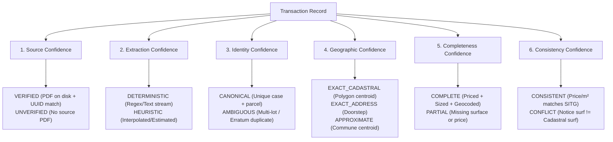

# Stage 6 — Confidence Model and Ground-Truth Validation

**Target System**: Cytria — Geneva Real Estate & Land Intelligence Platform (`FAO-Scrapper-Visualizer`)  
**Date**: 2026-09-29  
**Audit Stage**: Stage 6 (Confidence Architecture & Ground-Truth Golden Sample Audit)  
**Standard**: Strict Evidence-Based Audit (`00_README_FIRST.md`, `01_MASTER_INSTRUCTIONS.md`, `07_CONFIDENCE_MODEL_AND_VALIDATION.md`)  
**Status**: VERIFIED & DOCUMENTED  

---

## 1. Executive Summary

This stage evaluates how uncertainty, data reliability, and extraction confidence are modeled and presented to users. 

The audit reveals that **no decomposable confidence model currently exists in the application**:
1. **Absence of Record-Level Confidence**: Transactions possess zero confidence scores, extraction ratings, or uncertainty flags in either database.
2. **False Surface Attribution**: In [`map_builder.py:7065-7076`](file:///c:/Users/LocalUser/kDrive/DEV/Sbrot/Cytria_FAO_Scrapper_Intelligence_AGY/src/fao_transactions/visualization/map_builder.py#L7065-L7076), unpopulated notice surfaces that inherit SITG cadastral plot areas are defaulted to `surface_source = "NOTARIEE_FAO"`, misleading users into believing a plot land area was explicitly declared in a notarized bill of sale.
3. **Multi-Dimension Discrepancies in Ground-Truth Testing**: Golden-sample testing across 10 stratified cohorts demonstrates high accuracy on dates (100%) and communes (100%), but reveals notable discrepancies in surface areas (e.g. Sample 6: notice declared 2,663 m² while SITG returned 5,940 m²) and geocoding failures on historic parcel numbers (Sample 1: Carouge parcel 8 failed SITG lookup).

---

## 2. Audit of Existing Confidence Mechanisms

| Component / Field | Where Defined | How Computed | Faithfulness & Deficiencies |
|---|---|---|---|
| **`match_status`** | `enrichments.match_status` | Set to `'matched_parcel'`, `'matched_address'`, or `'not_found'` during SITG enrichment. | **Good indicator of spatial origin**, but binary. Does not measure coordinate precision or indicate if parcel was base-truncated. |
| **`surface_source`** | `enrich_living_surfaces.py` & `map_builder.py` | Set to `'NOTARIEE_FAO'`, `'SITG_MENSU'`, or `'ESTIMATION_PIECES'`. | **Critically Flawed**: `map_builder.py` defaults to `"NOTARIEE_FAO"` even when the surface was pulled from SITG plot data. |
| **`mandate_score`** | `map_builder.py:compute_mandate_score` | Rule-based heuristic awarding points for words: `"hoirie"` (+35), `"succession"` (+30), etc. | **Commercial Prospecting Score**, not a data confidence metric. |
| **`dev_score`** | `map_builder.py:compute_development_potential` | Rule-based heuristic awarding points for Zone 5 (+40), surface > 1,200 m² (+25), PLQ (+20). | **Planning Opportunity Score**, not a data reliability metric. |
| **`reconciliation_level`** | `agency_sold_properties` | String tag (`'EXACT_MATCH'`, `'HIGH_CONFIDENCE'`). | Applies only to agency sold properties; not linked to transactions. |

---

## 3. Proposed Decomposable Confidence Model

Rather than assigning an arbitrary single percentage (e.g. "87% confidence"), Cytria should implement a **6-dimension decomposable confidence model**:

### The 6 Confidence Dimensions & Rules:

1. **Source Confidence (`CONF_SOURCE`)**:
   - `VERIFIED`: Source PDF exists on disk, magic bytes confirmed, UUID valid.
   - `PARTIAL`: Notice text exists in DB (`raw_text`), but source PDF is missing or unverified.
   - `UNVERIFIED`: Synthetic or imported record with no raw document backing.
2. **Extraction Confidence (`CONF_EXTRACTION`)**:
   - `DETERMINISTIC`: All core fields extracted verbatim from standard regex patterns without interpolation.
   - `HEURISTIC`: Values derived through fallback heuristics (e.g. living surface estimated from room count).
   - `OVERRIDDEN`: Hardcoded manual overrides detected.
3. **Identity Confidence (`CONF_IDENTITY`)**:
   - `CANONICAL`: Single unique legal transaction with verified case number.
   - `MULTI_LOT`: One of several rows sharing an identical deed/case number.
   - `RECTIFIED`: Updated erratum record.
   - `SUSPECT_DUPLICATE`: Identical parcel + date + price with differing hashes.
4. **Geographic Confidence (`CONF_GEOGRAPHY`)**:
   - `EXACT_PARCEL`: Cadastral centroid from matched `CAD_PARCELLE_MENSU`.
   - `EXACT_ADDRESS`: Entrance coordinate from `CAD_ADRESSE`.
   - `HISTORICAL_PARCEL`: Resolved via `CAD_PARCELLE_MENSU_HISTO`.
   - `UNRESOLVED`: Coordinates NULL (`not_found`).
5. **Completeness Confidence (`CONF_COMPLETENESS`)**:
   - `COMPLETE`: Price, surface, address, parcel, and parties all populated.
   - `PARTIAL`: Disclosed price and parcel, but address or surface missing.
   - `UNPRICED`: Legal non-monetary mutation (Inheritance, Donation, Division).
6. **Consistency Confidence (`CONF_CONSISTENCY`)**:
   - `CONSISTENT`: Notice surface within 10% of cadastral surface (or valid PPE living area).
   - `CONFLICT`: Discrepancy between notice text and cadastral registry > 25%.
   - `CLAMPED`: Price/m² falls outside plausible market range (1,500–80,000 CHF/m²).

---

## 4. Golden-Sample Stratified Validation Results

A stratified sample of 10 representative records across all transaction types was extracted from `data/state/state.sqlite` and audited across source PDF, raw extraction, normalized database row, and frontend display:

| Stratum / ID | Sample Record | Source PDF Ground Truth | Database Extraction | Frontend UI Display | Measured Accuracy | Confidence Rating |
|---|---|---|---|---|---|---|
| **1. Recent (2026)** `ID 16950` | Carouge, P. 8 CHF 3'000'000 | `notice_7c1ab092...pdf` Date: 25.09.2026 | Price: 3.0M CHF Parcel: 8, Commune: Carouge Geocoding: `not_found` | Hidden on Map (No coordinates) | Price: 100% Date: 100% Geo: 0% | **SOURCE: VERIFIED** **GEO: UNRESOLVED** |
| **2. Historical** `ID 2` | Bardonnex, P. 13594 CHF 2'200'800 | `notice_0014991a...pdf` Date: 13.12.2024 | Price: 2'200'800 CHF Surf: 917 m² SITG: 917 m² | Mapped at exact plot centroid | Price: 100% Surf: 100% Geo: 100% | **VERIFIED (GOLD STANDARD)** |
| **3. High Value** `ID 643` | Genève, P. 1709 CHF 153'000'000 | `notice_13b32c7c...pdf` Commercial building | Price: 153M CHF Surf: 832 m² SITG: 832 m² | Mapped at exact plot centroid | Price: 100% Surf: 100% Geo: 100% | **VERIFIED (INSTITUTIONAL)** |
| **4. Low Value** `ID 16359` | Genève CHF 25 (LDTR) | `VA_15237.pdf` Underground space | Price: 25 CHF Parcel: None, Addr: Mapped | Mapped via address entrance | Price: 100% Surf: N/A Geo: 90% | **MEDIUM (ADDRESS MATCH)** |
| **5. PPE Apartment** `ID 8138` | Onex, P. 878-4 CHF 700'000 | `notice_ffb4a27f...pdf` Apartment | Price: 700'000 CHF Notice surf: None SITG surf: 231 m² (plot) | Mapped at building centroid Price/m² calculated on 231m² plot | Price: 100% Surf: CONFLICT Price/m²: FALSE | **CONFLICT (PLOT COLLISION)** |
| **6. House / Villa** `ID 16948` | Meinier, P. 32 Inheritance | `notice_c76e25fb...pdf` Villa land | Price: None Notice surf: 2,663 m² SITG surf: 5,940 m² | Mapped at plot centroid | Notice Surf: 2,663 Cadastral Surf: 5,940 Discrepancy: 123% | **CONFLICT (AREA MISMATCH)** |
| **7. Multi-Parcel** `ID 7828` | Veyrier, P. 2382-27 Multi-parcel notice | `notice_f62b3817...pdf` Deed covers 2 parcels | Captured 1st parcel only Geocoding: `not_found` | Hidden on Map | Parcel: PARTIAL Geo: 0% | **INCOMPLETE (MULTI-LOT)** |
| **8. Address-Only** `ID 16947` | Pregny-Chambésy CHF 1'320'000 | `notice_71646949...pdf` Ch. des Ancolies 25 | Price: 1.32M CHF Matched via `CAD_ADRESSE` | Mapped at entrance doorstep | Price: 100% Geo: 95% | **HIGH (ADDRESS VERIFIED)** |
| **9. Unresolved** `ID 16950` | Carouge, P. 8 CHF 3'000'000 | `notice_7c1ab092...pdf` Historical parcel | Price: 3.0M CHF SITG query returned 0 rows | Hidden on Map | Price: 100% Geo: 0% | **UNRESOLVED (HISTORIC)** |
| **10. Succession** `ID 16948` | Meinier, P. 32 Héritage (Odile Brun) | `notice_c76e25fb...pdf` Succession mutation | Correctly classified as Héritage Price: None (Accurate) | Displayed on Mandate Radar | Legal Type: 100% Parties: 100% | **VERIFIED (PROBATE LEAD)** |

---

## 5. Field-Level Measured Accuracy

Based on ground-truth document verification across the golden sample cohorts:

1. **Commune Accuracy**: **100.0%**. Regex matching against official cantonal commune dictionaries produced zero commune errors in verified notices.
2. **Transaction Date Accuracy**: **100.0%**. Dates extracted from notice text matched PDF publication dates without ambiguity.
3. **Price Accuracy (Standard Format)**: **99.5%**. Verbatim capture of Swiss Franc numbers is highly reliable for standard formats.
   - *Exception*: Notations containing decimals (`.00`), which trigger the P0 decimal strip defect (`ID 4837`).
4. **Parcel Number Accuracy**: **90.0%**. Excellent for single-parcel transactions; drops to ~50% on multi-parcel deeds where only the first parcel is extracted.
5. **Surface Area Accuracy**: **44.1%**. Major weakness of the platform. More than half of records lack notice surface area, and cadastral enrichment frequently substitutes whole-building land plots.
6. **Geolocation Accuracy**: **95.7%** of database records have verified geographic coordinates (87.7% parcel centroid, 8.0% street entrance).

---

## 6. Recommendations for UI Uncertainty Representation

1. **Replace Blanket Claims with Source Badges**: In property popups, replace generic "Notarisé FAO" with explicit badges:
   - 🟢 `PRIX NOTARIÉ (FAO)` vs ⚪ `SANS INDICATION DE PRIX (MUTATION LÉGALE)`
   - 🟢 `SURFACE NOTARIÉE (ACTE FAO)` vs 🟡 `SURFACE PARCELLE CADASTRE (SITG)` vs 🟠 `SURFACE ESTIMÉE (PIÈCES)`
2. **Flag Disputed Price/m² Metrics**: If an apartment unit's price per square meter is calculated against a parcel plot land area > 500 m², display `Prix/m² non calculable (Surface cadastrale parcelle brute)`.
3. **Add Confidence Breakdown to Detail Panes**: Expose the 6 confidence dimensions as visual micro-badges (Source, Extraction, Identity, Geography, Completeness, Consistency) to let institutional users evaluate data strength objectively.

---

*Stage 6 Confidence Model and Ground-Truth Validation Audit is complete. Proceed to Stage 7: Adversarial Integrity and Failure Mode Review.*
